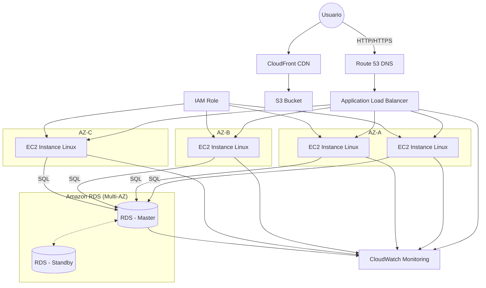

# xpe_desafiofinal_arq_solucoes_2025
Desafio final de arquitetura de soluções xpe 2025

Cloud AWS

```mermaid

flowchart TB
    %% -----------------------------
    %% Usuário / Entrada
    %% -----------------------------
    User((Usuario)) -->|HTTP/HTTPS| Route53[Route 53 DNS]
    Route53 --> ALB[Application Load Balancer]

    %% -----------------------------
    %% AZ-A
    %% -----------------------------
    subgraph AZ-A
        direction TB
        EC2A1[EC2 Instance Linux]
        EC2A2[EC2 Instance Linux]
    end

    %% -----------------------------
    %% AZ-B
    %% -----------------------------
    subgraph AZ-B
        direction TB
        EC2B1[EC2 Instance Linux]
    end

    %% -----------------------------
    %% AZ-C
    %% -----------------------------
    subgraph AZ-C
        direction TB
        EC2C1[EC2 Instance Linux]
    end

    %% Auto Scaling Group
    ALB --> EC2A1
    ALB --> EC2A2
    ALB --> EC2B1
    ALB --> EC2C1

    %% -----------------------------
    %% Banco de Dados
    %% -----------------------------
    subgraph Database["Amazon RDS (Multi-AZ)"]
        RDS1[(RDS - Master)]
        RDS2[(RDS - Standby)]
    end

    EC2A1 -->|SQL| RDS1
    EC2A2 -->|SQL| RDS1
    EC2B1 -->|SQL| RDS1
    EC2C1 -->|SQL| RDS1
    RDS1 <-.-> RDS2

    %% -----------------------------
    %% Storage + CDN
    %% -----------------------------
    User --> CloudFront[CloudFront CDN]
    CloudFront --> S3[S3 Bucket]

    %% -----------------------------
    %% IAM
    %% -----------------------------
    IAM[IAM Role]
    IAM --> EC2A1
    IAM --> EC2A2
    IAM --> EC2B1
    IAM --> EC2C1

    %% -----------------------------
    %% Observabilidade
    %% -----------------------------
    CloudWatch[CloudWatch Monitoring]
    ALB --> CloudWatch
    RDS1 --> CloudWatch
    EC2A1 --> CloudWatch
    EC2A2 --> CloudWatch
    EC2B1 --> CloudWatch
    EC2C1 --> CloudWatch

```
